# Architecture & System Diagrams

### Intelligent Option Pricing & Risk Analytics Platform

> **Project:** Option Pricing Using Monte Carlo Simulation & Deep Learning  
> **Tech Stack:** Python · FastAPI · PyTorch · HTML/CSS/JS · SQLite · Kubernetes  

---

# Part 1 — Architecture Choice

## ✅ Chosen Architecture: Monolithic Architecture (Modular Monolith)

### Why Monolithic?

| # | Reason | Explanation |
|---|--------|-------------|
| 1 | **Single Deployment Unit** | The entire backend (Pricing Engine, ML, DL, Auth, Explainability, RAG) runs as one FastAPI application on one server process. |
| 2 | **Shared Data Layer** | All modules share a single SQLite database for authentication and in-memory model objects — no inter-service messaging or distributed storage needed. |
| 3 | **Tight Module Coupling** | The DL layer directly calls the Monte Carlo engine for residual learning; the Explainability module directly imports ML/DL models for SHAP analysis. These are in-process function calls, not network requests. |
| 4 | **Simplicity** | No need for service discovery, API gateways, or container orchestration complexity during development. A single `uvicorn app.main:app --reload` starts everything. |
| 5 | **Low Latency** | In-process function calls between Pricing → ML → DL → Explainability are sub-millisecond, whereas microservices would add network overhead for each inter-service call. |
| 6 | **Team Size** | A single developer/small team can manage one codebase more efficiently than 5+ separate microservices. |

### How It Works in This Project

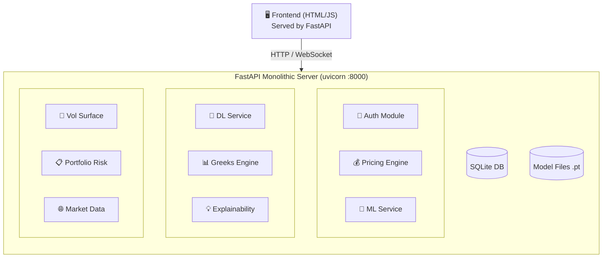

**Key characteristics:**

| # | Feature | Detail |
|---|---------|--------|
| 1 | **Single Process** | `uvicorn` starts FastAPI, loading all modules into one Python process |
| 2 | **Shared Memory** | ML/DL models loaded once, shared across all request handlers |
| 3 | **Modular Internals** | Clean separation: `pricing.py`, `ml.py`, `dl.py`, `auth.py`, `explain.py`, etc. |
| 4 | **Static Frontend** | HTML/CSS/JS served as static files from the same FastAPI server |
| 5 | **Embedded DB** | SQLite for authentication — no external DB server needed |

---

# Part 2 — System Diagrams

---

## Diagram 1: Use Case Diagram

> **Purpose:** Shows who uses the system (actors) and what actions they can perform.

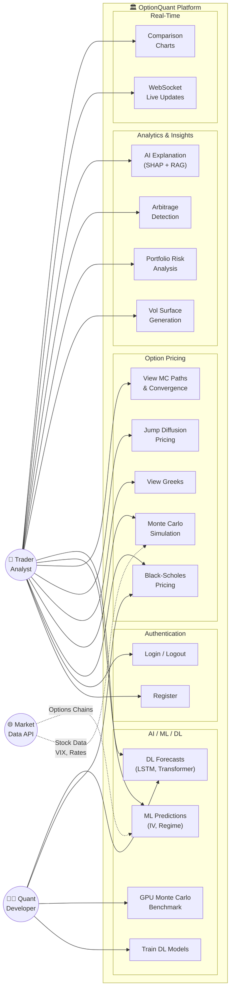

### Actors

| Actor | Role | Use Cases |
|-------|------|-----------|
| **👤 Trader / Analyst** | Authenticated end-user | Price options, view Greeks, run ML/DL predictions, monitor portfolio, view charts |
| **👨‍💻 Quant Developer** | Admin / power user | Train DL models, run GPU benchmarks, administer platform |
| **🌐 Market Data API** | External data source | Supply stock prices, VIX index, treasury rates, options chains |

---

## Diagram 2: Class Diagram

> **Purpose:** Shows the main classes, their attributes, methods, and relationships.

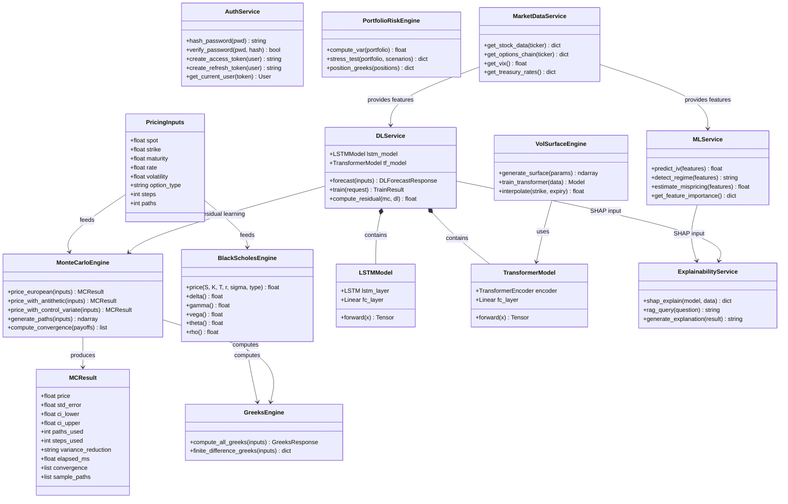

### Key Relationships

| From | To | Relationship |
|------|----|-------------|
| `DLService` | `MonteCarloEngine` | Residual learning — DL corrects MC base price |
| `DLService` | `LSTMModel`, `TransformerModel` | Composition — owns both neural network models |
| `MLService`, `DLService` | `ExplainabilityService` | SHAP feature attribution on trained models |
| `MarketDataService` | `MLService`, `DLService` | Provides real-time features for inference |

---

## Diagram 3: Data Flow Diagram (DFD)

### Level 0 — Context Diagram

> **Purpose:** Bird's-eye view of the entire system as a single process.

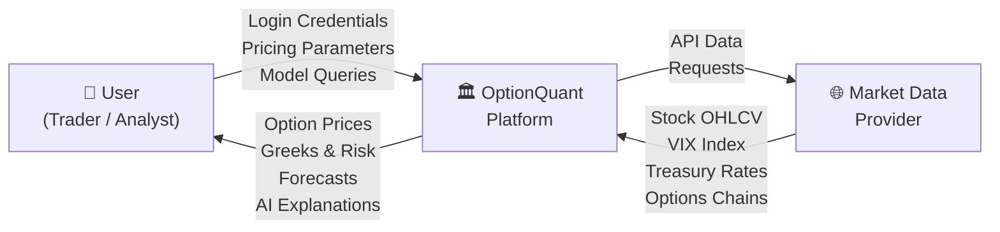

### Level 1 — Major Processes

> **Purpose:** Shows the 8 major processes and how data flows between them.

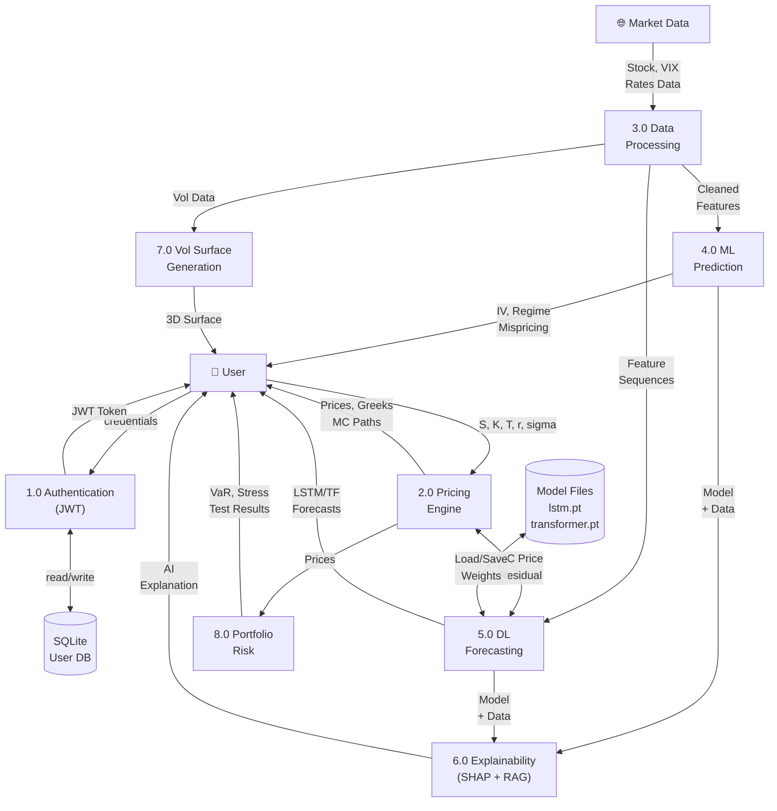

### Level 2 — Pricing Engine Detail

> **Purpose:** Expands Process 2.0 to show internal data flow within the pricing engine.

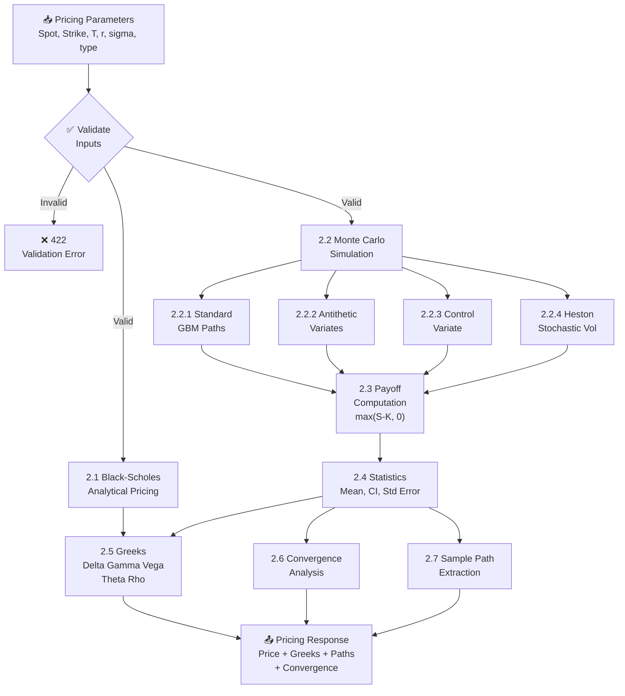

---

## Diagram 4: Component Diagram

> **Purpose:** Shows the major software components/modules and how they are layered.

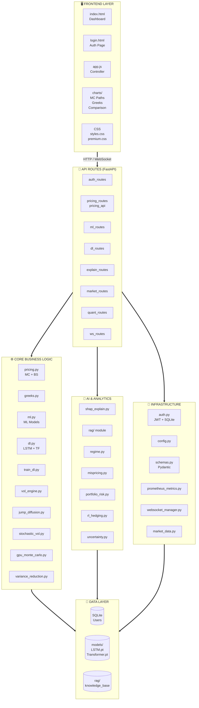

### Layer Summary

| Layer | Files | Responsibility |
|-------|-------|---------------|
| **Frontend** | `index.html`, `login.html`, `app.js`, `charts/` | User interface, visualization, input forms |
| **API Routes** | `*_routes.py`, `pricing_api.py` | HTTP endpoint definitions, request validation |
| **Core Logic** | `pricing.py`, `greeks.py`, `ml.py`, `dl.py`, etc. | Business algorithms (BS, MC, LSTM, Transformer) |
| **AI & Analytics** | `shap_explain.py`, `rag/`, `regime.py`, etc. | SHAP explainability, RAG, regime detection, portfolio risk |
| **Infrastructure** | `auth.py`, `config.py`, `schemas.py`, etc. | Auth, config, Pydantic schemas, Prometheus, WebSocket |
| **Data** | SQLite DB, `.pt` files, RAG knowledge base | Persistent storage for users, models, and documents |

---

## Diagram 5: Sequence Diagrams

### 5.1 — User Login Flow

> **Purpose:** Step-by-step interaction when a user logs in.

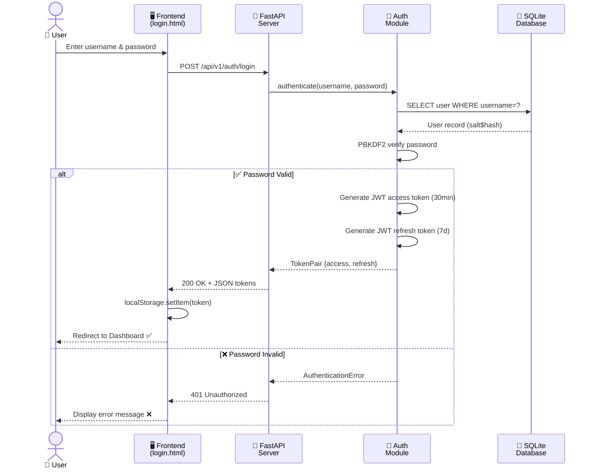

### 5.2 — Monte Carlo Option Pricing

> **Purpose:** Step-by-step interaction for pricing an option via Monte Carlo.

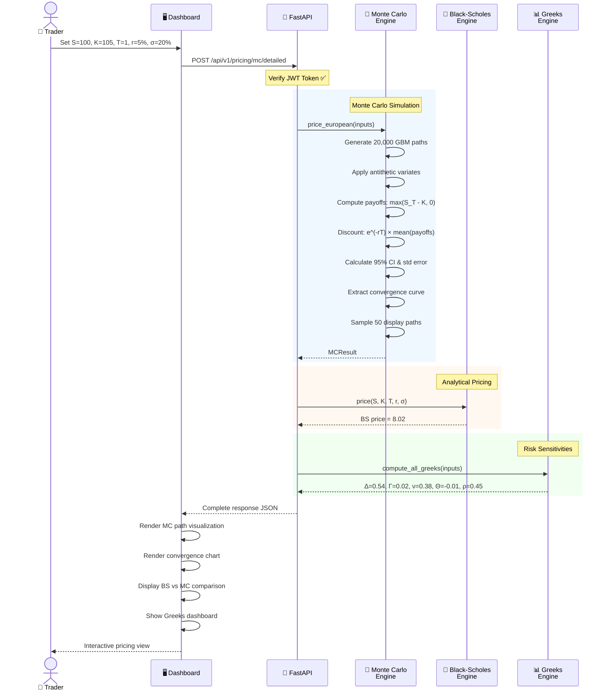

### 5.3 — DL Forecast with Residual Learning

> **Purpose:** Shows how the Deep Learning service combines LSTM + Transformer + Monte Carlo for hybrid pricing.

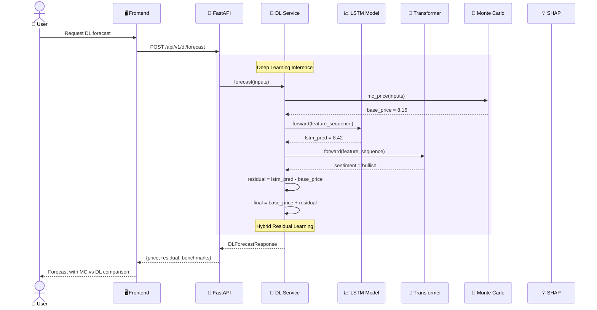

---

## Diagram 6: Deployment Diagrams

### 6.1 — Local Development

> **Purpose:** How the system runs on a developer's machine.

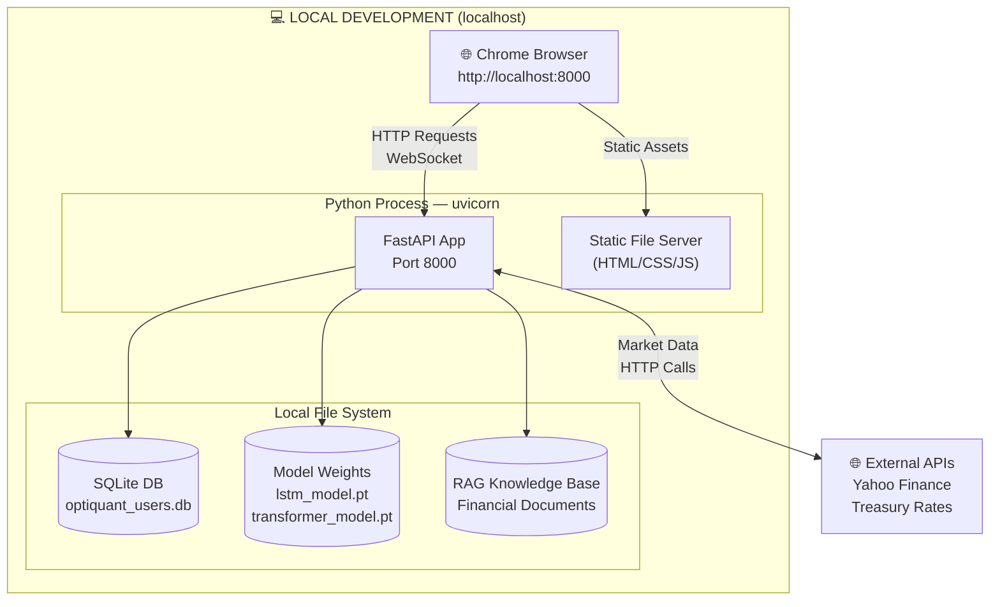

### 6.2 — Production Kubernetes Deployment

> **Purpose:** How the system is deployed in a production Kubernetes cluster.

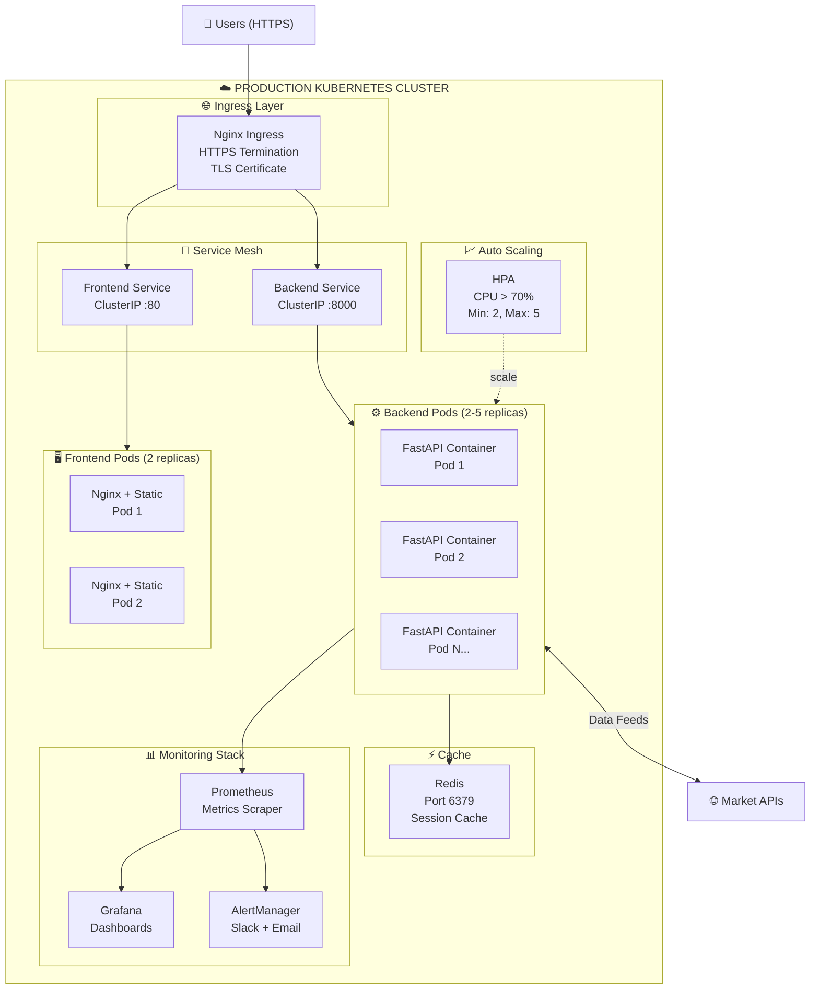

### 6.3 — CI/CD Pipeline

> **Purpose:** Automated build, test, and deployment pipeline.

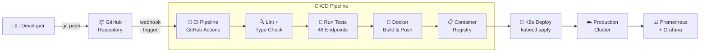

---

# Summary

| # | Diagram | Type | Purpose | Key Details |
|---|---------|------|---------|-------------|
| 1 | **Use Case** | Behavioral | Who uses the system and what they do | 3 actors, 17 use cases across 5 groups |
| 2 | **Class** | Structural | Internal code structure and relationships | 14 classes with attributes, methods, and associations |
| 3 | **DFD** | Data Flow | How data moves through the system | 3 levels: Context → Major Processes → Pricing Detail |
| 4 | **Component** | Structural | Module organization and dependencies | 6 layers: Frontend → Routes → Core → AI → Infra → Data |
| 5 | **Sequence** | Behavioral | Step-by-step interactions over time | 3 flows: Login, MC Pricing, DL Residual Forecast |
| 6 | **Deployment** | Physical | Where the system runs | Local dev, K8s production, CI/CD pipeline |
